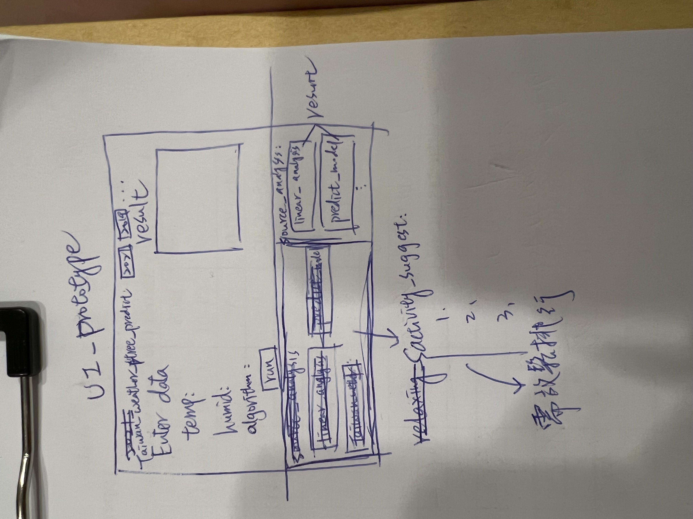

g# Group Name: stress forever
# Member: 110599002、109598113
# Project Name: The relationship between weather and human stress

# 氣象局帳號授權：CWB-3D718C34-45A2-4CAF-BD8F-35CD4C2D20F3

# Link:
    - https://www.kaggle.com/laavanya/stress-level-detection?select=Stress-Lysis.csv
    - https://data.gov.tw/dataset/130307
    - https://www.kaggle.com/
    - https://opendata.cwb.gov.tw/dist/opendata-swagger.html
    - https://opendata.cwb.gov.tw/userLogin
    - https://opendata.cwb.gov.tw/dataset/climate?page=1
    - [各月旅遊人次] https://admin.taiwan.net.tw/FileUploadCategoryListC003330.aspx?CategoryID=2638da16-f46c-429c-81f9-3687523da8eb&appname=FileUploadCategoryListC003330
    - [臺灣地區平均氣溫、濕度] https://stat.motc.gov.tw/mocdb/stmain.jsp?sys=100&funid=a8101
    - [SVC model=linear vs linearSVC]https://blog.csdn.net/qq_23069955/article/details/80961186
    - [SVC model=linear vs linearSVC]https://blog.csdn.net/qq_39537898/article/details/121883511
    - [SVM model=rbf]https://ithelp.ithome.com.tw/articles/10201279
    - [AdaBoostClaasifier]https://www.796t.com/content/1549060055.html

# Tool:
    - https://datascienceparichay.com/article/read-csv-files-using-pandas-with-examples/

# Timeline:
    - 3/10 19:00-23:30 discuss project plan
    - 3/17 20:00-22:30 environment setting
    - 3/27 22:00-00:00 plots data directly and analyze(linear analysis)
    - 4/02 21:00-00:10 k-nn done
    - 4/07 19:30-22:30 midterm report
    - 4/13 23:00-02:00 read papers
    - 4/14 11:00-13:30 write introduction
    - 4/14 18:00-19:00 draw timeline
    - 4/14 21:30-00:00 midterm report and presentation practice
    - 4/29 10:00-11:50 correlation coefficient and part of SVM
    - 4/29 19:00-01:10 SVM, Decision Tree, Transfer all code to python
    - 4/30 21:30-11:30 modified the code and discuss what to do next

# 3/27 analyze directly plots(without using algorithm)
    - 溫度越高壓力越大
    - 濕度越高壓力越大
    - 壓力越大走路步數越多 (步數多無法推論可抒壓)

# next time
    - 需要找放鬆活動的排行資料，可以是資料形式或是相關研究結果，資料較佳，可做分析
    - 整理台灣一年度溫濕度資料(2021, 2020, 2019)
    - 做預測介面(python GUI)

# Weather Data
### 2021
    - Humidity []
    - Temperature []

### 2020
    - Humidity []
    - Temperature []

### 2019
    - Humidity []
    - Temperature []

    

# Food
1. 酸菜白肉 VS 叻沙
2. 鮭魚捲
3. 部隊鍋
4. 拉麵

# Dessert
1. 紅豆麻糬捲
2. 大福
